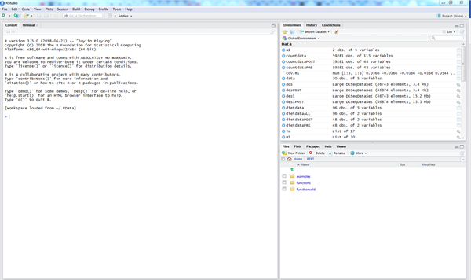

```{r echo=FALSE}
exerciseNumber=0;
exercise <- function(x="") {
  exerciseNumber <<- exerciseNumber+1; return(sprintf("## Exercise %d. %s", exerciseNumber, x))
  }
sectionNumber=0;
section <- function(x="") {
  sectionNumber <<- sectionNumber+1; return(sprintf("# **Section %d. %s**", sectionNumber, x))
  }

subsection <- function(x="") {
  return(sprintf("## %s", x))
  }


exampleNumber=0;
example <- function(x="") {
  exampleNumber <<- exampleNumber+1; return(sprintf("## Worked Example %d. %s", exampleNumber, x))
  }

```

`r section("Introduction")` 

This course will introduce R statistical software, examples of performing common tasks in scientific data analysis, where to go for further support and some tips for good practice when using R.

The aim is to become familiar with the R/RStudio environment and some common functions and workflows.  This will enable you to learn the specific functions that you need on your own or with further training.  
Specifically this course will bring you up to the level you need to attend the externally run statistics courses provided at NBI, that assume a working knowledge of R and RStudio.

The data you need to complete the training exercises is in the accompanying file (Introstat.xlsx).  All of the commands for the worked examples and the exercises is in the file TutorialScript.R.  The commands for the worked examples are also typed out here.


For those who have run through these notes already and completed the exercises there are some additional exercises that you can try to complete during the course.

`r subsection("Learning objectives")` 

We will focus on the tasks used in a typical analysis of a single scientific dataset, mirroring the tasks usually conducted in other statistical software.

### Specific tasks:

Day 1:  R and RStudio basics

*	Making an Rstudio project
*	Loading packages
*	Loading a dataset into R from an Excel file
*	Exploring your data and calculating descriptive statistics
*	Simple hypothesis tests

Day 2:  Linear models

* Estimating, diagnosing and reporting a regression model

Day 3:  Graphics

* Making graphics using 'base' graphics and the ggplot2 package

### How to use R

* Using R and RStudio
* RStudio ‘projects’ and a good workflow
* The command line interface
* Using scripts for reproducibility
* Getting help
* Using packages

### How R works

* Objects and functions
* Data frames and vectors
* Types of data: numerics, factors, and strings
* Representing and handling ‘missing’ values
* The importance of ‘tidy’ data

`r section("Getting R and RStudio")` {#intro}

## What are R and RStudio?

R is a free and open source statistics package, initially developed during the 1990s, and that has now become the world’s most widely used and comprehensive statistical software.  R calls itself a ‘programming language *and* environment for statistic computing’.  

That is, 'R' refers both to the software itself and the programming language that you use to interact with it.

RStudio is a free open source integrated development environment (IDE) for R that makes working R much easier.  Most R users use RStudio and I recommend using RStudio for new users.

The great strength of R is in its contributed packages, these are community written add-ons that provide functions to perform almost any statistical, programming, or data-related task.  We will introduce some commonly used packages for data management, analysis and graphing during this course.

`r exercise("Getting started")`

## Getting R and RStudio

1. Download and install the latest version of R from https://cran.r-project.org/ 

2. Then download and install RStudio from https://www.rstudio.com/ 

3. Start RStudio.  It will detect your installation of R, and you should see a screen like this:



On the left is the console window, where you type commands and see output.  The windows on the right hold various useful tabs, here the top pane is showing the data I happen to currently have loaded in my environment (yours will initially be empty) and a viewer showing part of my filesystem at the bottom.  These right-hand windows can also show graphs, help files, and your command history.

## Check R and RStudio are working, run your first command

4. Click in the console window and type:

```{r eval=FALSE, echo=TRUE}
1+2
```

Press return on your keyboard.  You should see: 

```{r echo=FALSE, eval=TRUE}
1+2
```

This is the basic way in which R works.  We enter commands at the command prompt, and we get the output in the console window.

5. Try a few other mathematical functions at the R console.  Can you use R to find:
    a. The natural logarithm of 10
    b. The square root of 2
    c. The cube root of 10

`r section("Using projects and scripts")`

Before we go any further, we are going to start an RStudio ‘project’ to organise our work during this course. Using projects helps us to keep all of the data and analysis for a particular piece of work in the same place.

Click on ‘New &rarr; New project’ in the main toolbar.  Click ‘Start a new project in a brand new working directory’.  Then click ‘new project’ on the next screen.

Now you can choose where to create the new directory for your R project, and what to call it.  Make a project called ‘Rtraining’ or something like that, somewhere in your personal filestore.

Now, when you return to the main RStudio window you are working within your project.  Notice that the 'working directory' has automatically switched to the new directory that you created, and the 'files' tab on the bottom left of the window is now showing the root of the project directory you created.

## Making a script

We could do everything by typing commands into the console window as we have already seen, but this is not good if we want to remember or repeat something we have done, or share it with others.

So instead we will type our commands into R scripts and run them from there.  With a script you can run and re-run bigger analyses that chain together all the functions you need for data loading, cleaning, analysing and reporting.

Using scripts mean we can develop complex analyses, and that when we come back to them in six months, if something changes in our data that means we need to redo everything, or we want to tweak something in our analysis because of a reviewer's comment, we can easily do this without having to remember or reconstruct what we did.  

It is good to keep a separate R script for each analysis that you do, such that each starts with the functions to load the required data, do any cleaning or recoding that is necessary, then to perform and report the data analysis.

I have made an example of such a script, annotated with comments, in the files that accompany this handout.

`r example("Make a script")`

1. Make a new script.  Click on File &rarr; New File &rarr; R Script in the main RStudio window.  An empty 

2. Save your script with a sensible filename (even though it is empty).  Having unsaved scripts is a bad idea, RStudio is sometimes unstable and while it will try to recover unsaved work it is not always guarenteed to.  Get into the habit of saving your scripts regularly.

3. Put some of the mathematical functions that you have already tried into your script, with one on each line.

You can now run code from scripts in several ways.

1. If you press 'run' or type Ctrl+Enter on the keyboard, RStudio will send the line that the cursor is on to the R console and will run it.
2. If you highlight an area of the script and then hit 'run' (or press Ctrl+Enter) then RStudio will send all the highlighted code to the R console.
3. If you save the file, then press 'source', R will run all the commands from that file in sequence. You won't see any output unless you specifically ask for it (or press 'source with echo').

There are some subtle differences between what happends with run and source, but in general you can use either.  I typically use 'run' while developing scripts and 'source' when they are finished to get the final answers.

If you have your raw data saved, and you keep your scripts, then you don’t need to save your results or any of the variables that you generated or modified during your analysis.  So long as the orginal data doesn’t change, running the script will reproduce all of your analysis and output.  This is a better way of working than trying to save your environment with all of your results and tables in.

I have created a script including all the analyses from this tutorial, in TutorialScript.R.  Load this and have a look around.  Notice my comments to remind myself why I did things, this might be helpful when I next come to revise the analysis!

**Important:** Keep the R scripts and the data associated with this training course in the project directory, so that you can access them easily.

See:

* https://r4ds.had.co.nz/workflow-projects.html and 
* https://support.rstudio.com/hc/en-us/articles/200526207-Using-Projects

for more information on using projects and scripts

`r example("Object assigments")`

So far we have used R as a calculator.  Next we'll learn about how R stores and applys functions to data.  First some terminology:

### Functions

Everything in R is done by executing ‘functions’.  When you typed `1+2` at the console above you were calling the `+` function, with `1` and `2` as its arguments, and the result was printed in the console window.

Simple mathetical functions can be written using standard notation in this way (eg `1+2` or `3/4`) but functions are more commonly called by their *name*, with their *arguments* in brackets, separated by commas.  For example, to get say the logarithm (base 10) of 100, we would type

```{r }
### Try this directly in the console, and by running it from your new script.
log(x=100, base=10)
```

Here, `log` is the name of the function, with `x` and `base` its arguments.  The result (2) is the *value* of the function (the value is what is returned).

Try each of the following commands.  Do you understand what they do any why?

```{r eval=FALSE }
### From now on, keep everything you try in a script file.

log(x=100, base=10)
log(x=100)
log(base=10, x=100)
log(100,10)
log(10,100)
log()
log
```

## Objects

Instead of directly displaying the value of the function (‘value’ is what R calls the result of a function), you can give it a name and store it for later use:

```{r } 
x = 1+2
```

The `=` in this context represents ‘assignment’.  The line above says:

‘evaluate 1+2, and store the result in an object called x’  or more simply  ‘assign the value of 1+2 to x’.
You might find it easier to understand:

```{r }
x <- 1+2
```

This does exactly the same thing; some R users use `<-` instead of `=` for assignment, so both forms will come up when you’re looking at help or other people’s code.  I tend to use either interchangably.

So now you have an object called `x` in your *environment* that holds the number 3.  You can ask R to display the value of ‘x’ by just entering x (just entering the name of an object *prints* that object):

```{r }
x
```

Or you could do something else with x

```{r }
x*2
```

Note your new object and its value should now have appeared in the 'Environment' pane in RStudio.

To see the *class* of an object (what kind of thing is stored in the object), use the `class()` function.

```{r }
class(x)
```

Objects of different classes store different kinds of information.  We will come across objects of many different classes later.

`r exercise("More functions, and assigning values to variables")`

1.  Make a new object called y which has the value of x+3.  Then display y.
2.	Now change the value of x (eg using  x <- 6 ).  Does the value of y change?
3.	Objects can hold text strings instead of numbers.  Try:

```{r eval=FALSE}
myname <- "George"  #(or whatever your name is).
myname
```

What is the class of the ‘myname’ object?

4.	(Difficult!)  Look up the function to turn a text string into upper case (an internet search will help you).  Use this function to make a new object which has the same text as ‘myname’ but in upper case.

`r section("Types of data")`

We saw two object of two different 'classes' in the previous exercise. These classes were 'numeric' and 'character'.  The class of an object defines what kind of information it hold, and how other functions act on it.

There are four basic classes that you will commonly use and should be aware of.  These correspond to the types of data you might have.  The basic types are:

*	'numeric' – For keeping numerical data
*	'logical' – can only take the values (TRUE or FALSE)
*	'character' – for strings of text
*	'factor' – for labelled categorical variables (ordered or unordered)

You might also commonly come across objects of class:

* 'Date' - which is really just a number but formatted to represent a single date and time. R has a lot of useful functions for working with dates so if you have a dataset that includes dates it is worth exploring this.

Later in this tutorial we will see objects of class:

*	‘data.frame’ – storing datasets
*	‘lm’ – stores the all results of a linear regression model

## Character strings

Character strings represent text rather than numbers.  Strings are used to label categories in a dataset, to identify columns in a dataset, to make your outputs more readable.  You also might find that part of your data has been entered as a string, for example patient identifiers or gene names in a database, or responses to open ended questions.

Strings are identified in R (and in most other programming languages) by enclosing them in quotes.  Single quotes and double quotes can be used (and are treated almost identically), but double quotes are preferred.  For example try:


```{r eval=F}
print("Hello")

print('Hello')

# What happens here?
print(Hello)
```

A common mistake in R is to forget to enclose strings in quotes.  In which case R tries to interpret your input as an object name, leading to an error message if that name doesn’t exist.

## Logicals

Logicals represent binary information in the form `TRUE` or `FALSE`.  They most often arise as the result of a comparison, for example try:

```{r eval=FALSE}
3>2

"Hello" == "hello"  # note the double equals sign, this distinguishes assignment from comparison

```


`r section("Working with Vectors")`

So now we know how to store individual values, but our datasets are obviously much more complex than this.  The next building block is the 'vector' which is like a single column of values in a database, all of the same type.  We'll soon get on to assembling these into 'data.frames' to represent entire datasets, but here we'll focus on how vectors themselves work.

`r example("Creating and manipulating vectors")`

Type the following:

```{r }
a <- c(3,4,5)
```

This assigns the vector (3,4,5) to `a`.  `c()` is a common function in R which simply ‘combines’ its arguments into a vector. So in other words this command says ‘create a vector from the numbers 3,4 and 5, and call this vector object ‘a’.

Vectors can be any length.  Try:

```{r }
b <- 1:10
```

What does the `:` operator do?

You can display `a` just as you displayed `x` previously

```{r }
a
```

And as with a single value you can fun more interesting functions on `a`.  Make sure you understand what each of the functions below does and why:

```{r eval=FALSE}
a + 1

a * 2

a > 3  # what class does the value of this function have?

a + x

mean(a)

sum(a)

summary(a)
```

```{r eval=F}
plot(a)  # where did your plot appear?
```

Notice there are two kinds of function behaviour here.  Where a simple mathematical function or comparison was applied, R just appied it to each element of the vector in turn.  This is a powerful feature of R whereby you can efficiently peform functions or comparisons on entire columns of data all at once.

For other functions, like `mean()` and `sum()` a single number was returned based on combining the elements of the vector.

The elements of a vector must all be the same primitive type (that is, they must be all numerics, all character strings, all logicals or all factors)

`r exercise("Working with vectors")`

What happens when you try each of these commands?   Can you explain why?

```{r eval=F}

vectora <- c("George", "Matthew", "Marielle")
vectorb <- c("Yes", 3)
vectorc <- c(1, TRUE)

mean(c(2,4,6))

"Kate" %in% vectora

"George" %in% vectorb

vectorb == "George"

mean(vectorb)

```

## Accessors and subsetting

Accessors allow you to access or change individual elements of a vector.  For example, you can ‘subset’ one or more elements of a vector using the `[` operator as follows.

```{r }
a[1]

a[3]

a[c(2,3)]
```

What happens if you try `a[4]`.  Why?

As well as specifying the particular elements you want, you can also select elements that meet a certain condition.   For example:

```{r }
a[c(FALSE, FALSE, TRUE)]
```

The statement above is not something we are ever likely to do, but its helpful to undertstand the following:  Suppose we wanted the elements of a that were bigger than 3.  Then we would write

```{r }
a[a>3]
```

Here the comparison is applied element-wise, and the elements where the comparison is `TRUE` are returned.  

So this literally means: "return the values of ‘a’ at the positions where ‘a’ is greater than 3".

While this might seem like an odd thing to want to do now, it becomes important later, because this kind of ‘subsetting’ is one way to extract different parts of a dataset for analysis, for example all the men, , all the non-missing values, or all the patients with blood pressure greater than 140.

Individual elements of vectors can also be *altered* using the extract operator.  For example:

```{r }
a[2] <- 10

a
```

## Missing elements in vectors

Often your data will include missing values.  R uses `NA` to represent missing values.  For example the following creates a vector with a missing value in the fourth position:

```{r }
myvector <- c(10,21,32,NA,54)
```

Note the difference between `NA` (a missing value) and `"NA"` (a character string containing the letters N and A.  I have been tripped up by this a few times when `"NA"` has been entered into a dataset.)

`r exercise("Effect of missing values")`

Try some other functions with myvector to see what impact the missing data point has.

```{r eval=FALSE}
class(myvector)

plot(myvector)

myvector>20

mean(myvector) # what happens here?  Why?  Can you fix it?

is.na(myvector) # what does this do?

sum(is.na(myvector)) # can you explain what this does?
```

`r exercise("Get help!")`

1. I can never remember the name of the function to calculate the standard deviation of a numeric vector.  Look this up online (eg a google search for ‘standard deviation in R’), and use it to find the standard deviation of 'a'.

2. Make another numeric vector called 'b' (or anything you like; object names don’t have to be single letters).  

3. Draw a histogram of that vector (look it up!).

4. **Difficult!** Make a vector which is a sample of 100 values from a standard normal distribution (mean 0 and variance 1).  (The function `rnorm()` will help you with this.).  

5. Now plot a histogram only of the values that are greater than 0.

`r section("Working with datasets")` 

In this section we'll start working with data frames.  Data frames are the objects that R uses to store datasets for analysis.  You can think of a dataframe as a set of vectors all of the same length, with each vector representing a variable.  In the lecture we will discuss data frames and how to make sure your data can be represented in one or more data frames.

`r example("Loading data into R from Excel Part 1:  Installing a package")`

R is not used for data entry or storage; you are likely to have data stored as an Excel file, a csv file, in a database, or in some other format generated by a device.

So before we can do any analysis we need to import data.  We do this in code like everything else in R.

Base R (‘base’ R is R as it comes when you first download it) cannot read data from Excel files.  But there are several add-on ‘packages’ that can read Excel files (there are packages to read data from most common formats).  Currently the best package for reading Excel files is called `readxl` (there are several others but they do not work as well).

Packages are collections of functions and datasets related to a specific task.  They are most often created by R users for their own use and then shared with the community through the Comprehensive R Archive Network (CRAN) or Bioconductor, which makes it very easy to find and install them.

Here we will import a dataset from Excel using the `readxl` package.

First, readxl needs to be installed.  You can do this through the tools menu or by typing:

```{r eval=FALSE}
install.packages("readxl") # notice the quotes here
```

The first time you try to install a package, R will ask you where you would like to download packages from.  Select any UK CRAN mirror.

Now the package is installed.  We could now access its functions by using the package name and the function name, but its easier to first type:

```{r warning=FALSE}
library(readxl) # no quotes this time
```

‘library’ makes all of the functions in a package available for use without having to reference the package each time.  In R terminology everything in the package has been added to the search path, which is the set of places R will look when we refer to an object or a function.

Now we have the function `read_excel()` available, which reads data from an excel file.

Before we dive in and use it, we need to make sure our data is in a sensible place, and we understand how to use the function.  First, save the example data (`treedata.xlsx`) for this tutorial into a ‘data’ subdirectory of your project.

Open the dataset in Excel and make sure you understand the data that is there.

`r exercise("Read the help!")`

We are nearly ready to import some data.  But before using a new function its always good to read its documentation.

R and R packages are not as self-explanatory as other software, and so you should expect to spend a fair amount of time, particularly as you are learning R, reading documentation, vignettes, blogs, etc on what R can do, which packages exist, and how to use them.

`read_excel()` has a few different options so first we should look at the help file:

```{r eval=FALSE}
?read_excel # where does the helpfile appear?
```

Most R help files are structured in the same way.  They have a ‘Description’ section (what does the function do), a ‘Usage’ section (what is the syntax), an ‘Arguments’ section (detail of what all the options mean), a ‘Value’ section (what do I get when I run this) and some Examples.  The examples are usually very helpful.

Notice that `read_excel()` can extract data from different sheets and ranges of an Excel workbook, can use or ignore column names, and allows you to specify the type of data (numeric, dates, text etc) if you want to, or leave it to R to guess.

Many R packages also have vignettes or websites including simpler guides to their use in specific cases.  readxl has a website that you might find helpful:  https://readxl.tidyverse.org/

## Citing R and R packages

It is important to cite R and R packages you use correctly, particularly where the package is essential to make your analysis reproducible.  To find out how to cite a package use the `citation()` function.

How should you cite the ‘readxl’ package?

`r example("Loading data into R part 2:  Data frames")`

Now we’ll load the data.  We want to use the ‘tree species’ data from the introstat.xlsx spreadsheet. Open the spreadsheet in Excel and find this sheet.  The data we want is in the sheet called P1-TreeSpeciesData.

From the read_excel() help file we can deduce the syntax to load this data into R:

```{r }
TreeData <- read_excel(path="introstat.xlsx", sheet="P1-TreeSpeciesData", .name_repair = "universal")
```

(This assumes that the file ‘introstat.xlsx’ is in the current working directory.  The current working directory is shown just above the R console window).  You can see the files in the current working directory in the 'Files' tab on the bottom right of the RStudio window.

This line calls the `read_excel()` function, with the arguments ‘path’, ‘sheet’ set.  The other arguments will be set to their default values, which you can see from the help file.  

We could have set the range of the data in the spreadsheet (I usually do this for safety), but `read_excel()` can figure it out automatically most of the time; by default it picks the biggest continuous chunk of data starting in the top left of the sheet.

We set .name_repair to make sure that the names of the variables are valid R names that we can use in analysis commands.  Note in the Excel sheet some names have spaces or other punctuation marks.  These are not valid or sensible in object names, so .name_repair should be set to ‘universal’ to ensure column names are unique and valid.

Now we have a ‘data frame’ object called TreeData, which includes the data from the Excel sheet ready to process and analyse.  It’s a good idea to check that the data has been extracted as you expected, and we can inspect it in various ways.  Try:

```{r }
class(TreeData) # what is a 'tibble'?
```

What kind of an object is ‘TreeData’?

```{r eval=FALSE}
#See the whole dataset
TreeData

#This shows you the 'dimension' of your data frame (how many rows and columns it has).
dim(TreeData)
```

```{r eval=F}
# This opens a viewing window with your data in the top panel of RStudio.  Useful for small datasets but can break RStudio with big data.
View(TreeData)
```

```{r eval=FALSE}
# show the first few rows
head(TreeData)

# compare this to what 'summary' did to a vector!
summary(TreeData)

# another way to see a summary of the dataframe
```

`summary()` shows the name and summary information for each variable (each vector in the data frame), as it did in worked example 2.  (You can use `summary()` on many kinds of R objects, it usually shows you something sensible).

Finally, clicking on the arrow next to the object name in the Environment window will show you details of each column that the data frame includes.

Note that the class for each variable is listed by each column name in the Environment window above.

This is the same output that you would get from the `str()` function.

`r exercise("Vectors and data frames")`

1. What are the names of the vectors that comprise the TreeData dataframe?
2. What is the class of each?

A corollary of the fact that all elements of a vector must have the same class is that all the values in a single column of a dataset must have the same class.  That is, you cannot have a column in your dataset that includes the numeric value `3` and the character value `Green`.  This information would need to be stored in a different way.

`r section("Making summary statistics")`

A data frame is essentially a set of vectors, all of the same length, that have been stuck together into a rectangle such that each row describes unit of one observation, and each column includes a particular attribute of that observation.

This ‘tidy’ format is how we *must* store all our datasets for analysis.  If you have used SPSS, Stata or a relational database you will be familiar with this way of organising data. GraphPad Prism works differently, so you will need to change the way you organise data if you move from GraphPad Prism to R.

See the reference below on ‘tidy data’ for more on how to organise your data into one or more tidy data frames, you may not immediately think this is possible for your dataset, but it is! (and it is essential!)

For complex datasets, for example high throughput genomics combined with meta-data, your data might be stored as more than one dataframe, one for the main data and a separate data frame for the meta-data.

Once we have our data tidied and loaded into a data frame, we can access each varible as a vector and work on it exactly as we did in the section on vectors above.

We can access the individual vectors using the `$` accessor operator:

```{r }
TreeData$height
```

(see https://www.r-bloggers.com/2009/10/r-accessors-explained/ for more details r accessor functions)


This is just a vector, so we can use any of the functions for vectors to summarise this variable.  Try:
```{r }
mean(TreeData$height)

boxplot(TreeData$height)
```

This can be a useful way to summarise individual variables, although as a summary table it's very  limited!  Often we want to be able to summarise according to the levels of another factor.

(Here we will just discuss summarising a single variable by a single stratifying variable.  In a separate handout I discuss options for creating bigger summary tables of statistics.)

We will look at how to summarise a continuous 

## A continuous variable stratified by a grouping variable

Let’s get the heights by species.  We can do this using the ‘aggregate’ function:

```{r }
aggregate( height ~ species.name, FUN=mean, data = TreeData, )
```

Look at the help file for `aggregate()` to understand how the arguments are specified.  

Note from the help file there are two 

Here `aggregate()` uses the 'formula' interface.  It's important to understand this now because this is how variables are specified in many different R functions, eg to run analyses and make graphics.  Formulas are generally used in R to specify relationships between variables in a dataset.  Different functions use forumulas in different ways, but in general the left hand side of a formula represents one or more dependent variables, and the right hand represents variables that act as predictors or grouping variables.

`aggregate()` will use the function specified to its `FUN` argument to summarise the left-hand side variable, stratified by the right hand side variable.

The final `data` argument tells aggregate where to look for the variables that have been named.

## Tabulating a categorical variable over groups

For a categorical variable, a summary of frequency counts might be the most appropriate.  We can get most simply get this with the `table()` function:

```{r }
table(TreeData$species.name)
```

The ‘table’ function can also generate cross-tabs, by specifying two or three variables.  Note here how they are defined using the accessor operator.  `table` does not use the forumula interface we discussed above, although the sister function `xtabs()` does.

```{r }
table(TreeData$species.name, TreeData$health)
```

Tables of numbers are useful, but it might be more helpful to see the proportion of healthy trees by species.  To get this we can pass the table we just made into the prop.table() function:

```{r }
table1 <- table(TreeData$species.name, TreeData$health)
prop.table(table1)

```

The table above has calculated the ‘cell proportions’.  If we want the row percentages we need to set the `margin` option in `prop.table()` appropriately.  And we could round this to 2 d.p. by passing the resulting proportion table into the round() function:

```{r }
proptab1 <- prop.table(table1, margin=1)
round(proptab1, digits=2)
```

Remember ‘a[1]’ from earlier that returned the first element of the vector ‘a’? You can do a similar thing with two-dimensional structures like tables and data frames to return individual elements, rows or columns.  For example:

```{r }
proptab1[1,1] # get the element on the first row and first column

proptab1[,2] # this returns the second column only.

proptab1[4,] # return the fourth row only
```

`r exercise("Tables")`

What would be an easy way to convert these proportions to percentages?
Can you use prop.table() to generate column percentages instead of row percentages?

Further reading on the ‘extract’ operators: https://github.com/lgreski/datasciencectacontent/blob/master/markdown/rprog-extractOperator.md


`r section("Basic plots and hypothesis tests")`


`r example("Making basic plots")`

We’ve already seen the box plot in the previous section.  We can ask for this in a slightly different way, and stratify it by species:

```{r }
boxplot(height ~ species.name, data=TreeData)
```

We’ll make some improvements to this box plot when we discuss graphics.

`r example("Hypothesis tests")`

Is height associated on tree health?  We can generate a simple box plot as previously to examine this this time with some labels):

```{r }
boxplot( height ~ health, data=TreeData , 
         xlab="Height", ylab="Health",
         col="red") # Note the use of a multi-line command in a script!
```

It looks like the two variables might be related,  but we would like to perform a t-test to see if the difference is statistically significant, and to get an estimate (with confidence interval) for the difference.

The syntax is almost exactly the same as that used to generate the box plot.  We use the same formula `height~health` to again specify that height depends on health in our analysis:

```{r }
t.test( height ~ health , data=TreeData)
```

Note that t.test has returned ‘Welch Two Sample t-test’.  This is not the traditional t-test with equal variances assumes, by default R runs a t-test that does not assume equal variances across groups.   This is probably better, but if you want the traditional test you’ll have to look at the help file to get it.

In general it’s useful to read the documentation for any new function that you are using, because the default R behaviour might not be what you expect.

Note:  Note from the t.test help file: the default options are shown first, so here var.equal=FALSE is the default which you had to override with var.equal=TRUE in the your function call.

Exercise:  How would you run a paired t-test?  (No need to do it as we don’t have suitable data, but look at the help file.


# Answers and comment on the exercises
1a.:  Type y = x+3 or y <- x+3
1b.:  Subsequently changing x doesn’t change the value of y.  When y was created it used only the value of x at that time, and changing x afterwards doesn’t change y.
2:  No clues with this one, but the final answer should be 1.
5:  You could multiply the table of proportions by 100, either before or after you round it to 2 d.p.  Compare:

> 100*round(proptab1, digits=2)

> round(100*proptab1, digits=2)

If you look up the help for prop.table(), you’ll notice the second argument controls which margin the proportions are calculated over.  ‘1’ is the rows, ‘2’ is the columns.  If you left out margins altogether, you’d get the cell proportions.
6:  This was difficult.  R’s barplot function doesn’t have the nice formula interface that plot and boxplot have.  You need to calculate the proportions first, then pass them to barplot.  You already made the proprtions using prop.table(), so you could pass the second column of proptab1 into the barplot function:
barplot(proptab1[,2], horiz=TRUE)

You could also do this with another package like ggplot2, which does have a function to directly create the bar plot, we’ll see this in Day 2.
8:  You would add a ‘paired=TRUE’ argument (making sure that the data was set up correctly first).
10:  No, the regression coefficients aren’t the same.  The model is the same, but the reference group has changed.  When we entered the names of the species as a character vector, R selected “A. aulococarpa” as the reference (alphabetically the first).  When we created the factor from species., R assigned the lowest value to E. pellita, as this has the smallest numeric value (1) assigned to it, and this became the reference group for the second regression.  We could use the relevel() function to change the reference group of a factor if we wanted the outputs to match exactly.

